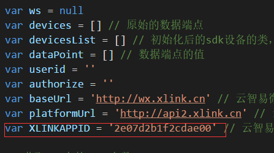

### 微信（设备）应用环境
#### 第一步：配置公众号和云智易应用
参考[微信公众号配置](https://docs.xlink.cn/pages/viewpage.action?pageId=4063254)完成应用配置

#### 第二步：把demo的index.html里面代码地址换成相应的云智易应用APPID



#### 第三步：使用微信开发者工具访问页面
```
如放到服务器地址为http://test.cn的wechat文件夹下面则访问，且微信的公众号id为wx6bce565776a81ced则访问地址为：
https://open.weixin.qq.com/connect/oauth2/authorize?appid=wx6bce565776a81ced&redirect_uri=http://test.cn/wechat/index.html&response_type=code&scope=snsapi_base&state=STATE#wechat_redirect
```
